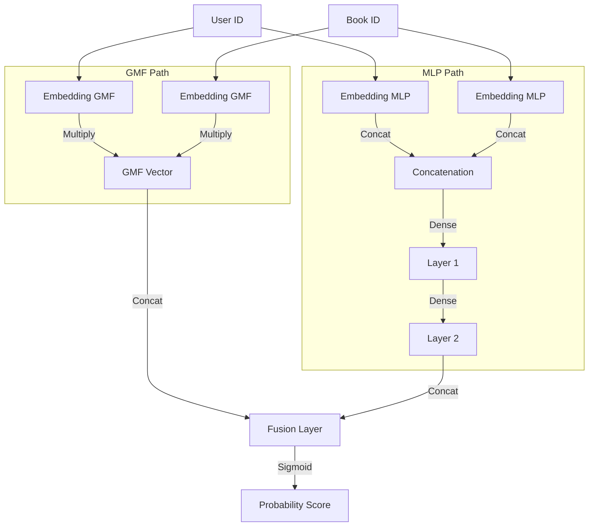

# Project Documentation: Hybrid Book Recommender System

This document provides a complete, "A to Z" detailed explanation of the Book Recommender project. It covers the data structure, theoretical concepts, and a step-by-step walkthrough of the codebase logic.

---

## 1. Project Overview

The goal of this project is to build a robust recommendation system that suggests books to users. It employs a **Hybrid Approach** combining two powerful techniques:

1.  **Collaborative Filtering (Neural Network)**: Learns user preferences based on past ratings. It answers the question: _"What have users similar to you liked?"_
2.  **Content-Based Filtering**: Recommends items similar to what the user has liked before, based on book metadata (tags, authors, titles). It answers the question: _"If you liked this book, what other books are textually similar?"_

By fusing these two signals, the system overcomes the limitations of each individual model (e.g., the "Cold Start" problem of Collaborative Filtering).

---

## 2. Data Structure Analysis

The project interacts with five primary CSV files. Here is a detailed breakdown of each:

### 2.1. `books.csv` (Metadata)

This is the central catalog of all books in the dataset.

- **Dimensions**: 10,000 rows (books).
- **Key Columns**:
  - `book_id`: The unique identifier used internally by the dataset (1 to 10,000).
  - `goodreads_book_id`: The ID used by the Goodreads website. This is crucial for linking to the `book_tags.csv` file.
  - `title` / `original_title`: The name of the book.
  - `authors`: Comma-separated list of authors.
  - `average_rating`: Global average rating on Goodreads.
  - `ratings_count`: Total number of ratings.
  - `image_url`: URL to the book cover (often removed during cleaning).

### 2.2. `ratings.csv` (Interactions)

Contains the explicit feedback given by users.

- **Dimensions**: ~6 million rows.
- **Key Columns**:
  - `user_id`: Unique identifier for the user.
  - `book_id`: corresponds to `book_id` in `books.csv`.
  - `rating`: Integer from 1 to 5.
  - **Purpose**: This data is the "fuel" for the Collaborative Filtering model.

### 2.3. `tags.csv` (Tag Definitions)

A dictionary mapping tag IDs to their text names.

- **Key Columns**:
  - `tag_id`: Unique Integer.
  - `tag_name`: The text label (e.g., "fantasy", "romantic-comedy", "young-adult").

### 2.4. `book_tags.csv` (Tag Links)

The bridge between Books and Tags. It shows how many times a specific tag was applied to a specific book.

- **Key Columns**:
  - `goodreads_book_id`: Matches `goodreads_book_id` in `books.csv` (NOT `book_id`).
  - `tag_id`: Matches `tags.csv`.
  - `count`: How many users applied this tag to this book. (Used to filter for the most relevant tags).

### 2.5. `to_read.csv` (User Intent)

A list of books users have marked as "Want to Read".

- **Key Columns**: `user_id`, `book_id`.
- **Note**: While available, this file is not utilized in the primary hybrid model flow logic, serving more as supplemental data for potential future features.

---

## 3. Codebase Walkthrough (A to Z)

The core logic resides in `data-cleaner.ipynb`. Below is the detailed flow of the code.

### Phase 1: Data Loading and Cleaning

**Goal**: Prepare a clean dataset for processing.

1.  **Ingestion**: The script uses `pandas.read_csv()` to load the raw data.
2.  **Noise Reduction**: Irrelevant columns that do not aid prediction are dropped from `books.csv`.
    - _Dropped_: `work_id`, `isbn`, `isbn13`, `language_code`, `image_url`, `small_image_url`, `best_book_id`, `books_count`, etc.
    - _Why?_ Machine learning models rely on meaningful signals. ISBNs and URLs are unique or structural data that don't imply "likability" in a semantic sense.

### Phase 2: Feature Engineering ("Tag Soup")

**Goal**: Create a rich text description for every book to enable Content-Based Filtering.

1.  **Merging Tags**: The script merges `book_tags.csv` with `tags.csv` to replace numeric IDs with actual names (e.g., replacing `11305` with `fantasy`).
2.  **Filtering Generic Tags**: A concise list of "stop tags" is removed (e.g., "to-read", "owned", "favorites"). These tags describe a user's _state_, not the book's _content_.
3.  **Top-10 Selection**: To keep the signal strong, only the **top 10 most frequently applied tags** for each book are retained.
4.  **Soup Creation**: A new column `tag_soup` (or `content_soup`) is created by concatenating:
    - All Author Names (spaces removed, e.g., "SuzanneCollins").
    - Book Title.
    - The 10 selected tags.
    - _Result_: A single string like: _"SuzanneCollins TheHungerGames young-adult fiction dystopian..."_

```mermaid
graph TD
    subgraph Raw Data
    B[books.csv]
    R[ratings.csv]
    T[tags.csv]
    BT[book_tags.csv]
    end

    subgraph Cleaning & Feature Engineering
    B -->|Drop Columns| B_Clean[Clean Books]
    BT -->|Merge| T_Named[Tags with Names]
    T -->|Merge| T_Named
    T_Named -->|Filter Generic| T_Content[Content Tags]
    T_Content -->|Group Top 10| T_Soup[Tag Soup]
    B_Clean -->|Combine| Content[Content Soup\n(Title + Author + Tags)]
    end

    subgraph Model Prep
    R -->|Map IDs| R_Mapped[Mapped Ratings]
    R_Mapped -->|Negative Sampling| TrainingData[(User, Book, Target 0/1)]
    end

```

### Phase 3: Collaborative Filtering Preparation (NCF)

**Goal**: Format the rating data for a Deep Learning model.

1.  **ID Mapping**: Deep learning models need contiguous inputs (0, 1, 2...). The script maps the arbitrary `user_id` and `book_id` integers to a clean range: `0` to `n_users-1` and `0` to `n_books-1`.
2.  **Implicit Feedback Conversion**:
    - The model treats high ratings (e.g., > 3) as **1 (Positive)**.
    - Everything else is effectively ignored in correct implementations, but here high ratings are treated as positive "interactions".
3.  **Negative Sampling (Crucial Step)**:
    - The model needs to know what users _dislike_. Since we only have "likes", we create fake "dislikes".
    - For every positive interaction (User U, Book B), the code generates a random pair (User U, Book R) that does _not_ exist in the data and labels it **0 (Negative)**.
    - This forces the model to learn to distinguish between "Real Matches" and "Random Noise".
4.  **Train/Validation Split**: The data is split (80/20) to ensure we can validate the model's accuracy on unseen data.

### Phase 4: Neural Network Architecture (NeuMF)

**Goal**: Build a brain that learns relationships between Users and Books.

The model uses the **Neural Matrix Factorization (NeuMF)** architecture:

1.  **Input Layers**: Receive the User ID and Book ID.
2.  **Embedding Layers**: Convert these single IDs into dense vectors (e.g., an array of 10 numbers). This vector represents the "personality" of the user or the "essence" of the book in a mathematical space.
3.  **Two Parallel Paths**:
    - **GMF (Generalized Matrix Factorization)**: Multiplies User and Item vectors element-wise. Captures linear relationships.
    - **MLP (Multi-Layer Perceptron)**: Concatenates vectors and passes them through Dense layers with ReLU activation. Captures complex, non-linear patterns.
4.  **Fusion**: The outputs of GMF and MLP are concatenated.
5.  **Output Layer**: A single neuron with a **Sigmoid** activation function.
    - _Output_: A probability score between 0.0 and 1.0.

**Training**: The model is trained using **Binary Cross Entropy** loss for 3 epochs.



### Phase 5: Content-Based Filtering (CBF)

**Goal**: Calculate similarity between books based on text.

1.  **TF-IDF Vectorization**:
    - The `tag_soup` strings are converted into a massive numerical matrix.
    - **Term Frequency (TF)**: How often a word appears in a book.
    - **Inverse Document Frequency (IDF)**: Penalizes words that appear everywhere (e.g., "fiction").
2.  **Cosine Similarity Matrix**:
    - The code calculates the cosine angle between every pair of books.
    - _Result_: A 10,000 x 10,000 matrix where `matrix[i][j]` tells you exactly how similar Book `i` is to Book `j` (from 0 to 1).

### Phase 6: Hybrid Recommendation Logic

**Goal**: Combine the best of both worlds.

The final function `recommend_hybrid` performs these steps for a target User `U`:

1.  **Candidate Selection**: Selects all books User `U` has _never_ read.
2.  **NCF Scoring**: Asks the Neural Network for the probability that User `U` will like each candidate book.
3.  **CBF Scoring (User-Centric)**:
    - It looks at User `U`'s _favorite_ books.
    - For each candidate book, it calculates the average textual similarity to those favorites.
4.  **Weighted Fusion**:
    - `Hybrid_Score = (Weight_NCF * NCF_Score) + (Weight_CBF * CBF_Score)`
    - Typical weights: 0.7 for NCF (Taste) and 0.3 for CBF (Content).
5.  **Ranking**: The books are sorted by `Hybrid_Score`, and the top 10 are returned.

```mermaid
graph TD
    User([User]) -->|Get ID| ModelNCF[NCF Model]
    User -->|Get Favorites| UserFavs[User Favorites]

    Candidates[Candidate Books<br>(Unread)] -->|Input| ModelNCF
    Candidates -->|Input| CBF_Calc[CBF Calculator]

    ModelNCF -->|Predict| ScoreNCF[NCF Score<br>(Taste)]

    UserFavs -->|Compare Vectors| CBF_Calc
    CBF_Calc -->|Avg Cosine Sim| ScoreCBF[CBF Score<br>(Relevance)]

    ScoreNCF -->|x 0.7| WeightedNCF
    ScoreCBF -->|x 0.3| WeightedCBF

    WeightedNCF -->|Sum| FinalScore[Hybrid Score]
    WeightedCBF -->|Sum| FinalScore

    FinalScore -->|Sort| Recommendations[Top 10 Books]
```

---

This structure ensures that:

- **Users get accurate predictions** (thanks to NCF).
- **Users get relevant genre matches** (thanks to CBF).
- **New items can be recommended** (via CBF similarity), and **complex user tastes are learned** (via NCF).
